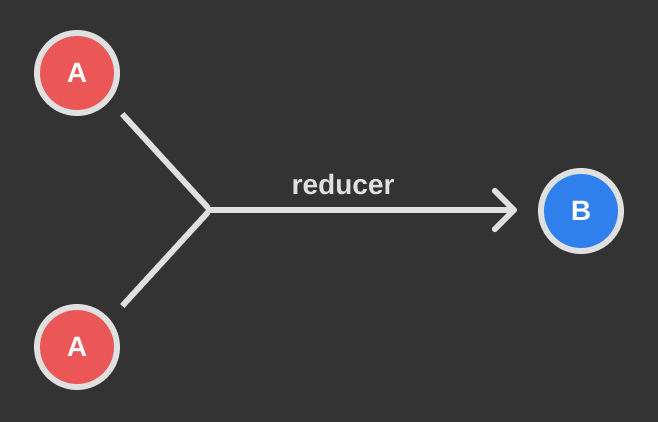
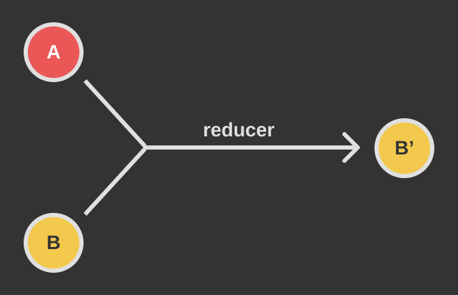
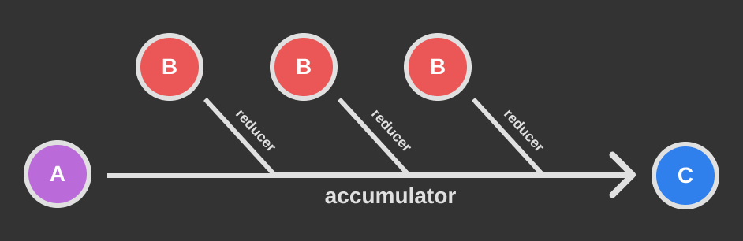

Thanks to the recent popularity of the [Flux](https://facebook.github.io/flux/) state model and
easy to use Flux implementations like [Redux](https://redux.js.org/) and
[MobX](https://mobx.js.org/index.html), reducers have become a hot topic. Don't worry if you're not
familiar with complex state management models or how reducers apply in the context of Flux, that's
a topic for a later article. Let's take a step back and look at reducers from the bottom up.

If you've worked much with JS, you may be familiar with `Array.prototype.reduce`. Let's forget that
for a second (we'll come back to it) and look at a vanilla reducer function.

```js
function reducer(val1, val2) {
  return val1 + val2;
}

reducer(1, 2); // 3
```

At their core, reducers take two inputs and return a single output. Reducers vary wildly in both
purpose and implementation, and as such they can be very useful in a ton of different contexts. The
example above is obviously a rather contrived example, but it's important to get a baseline
understanding before we go any further.

In our reducer above, we take two numbers and add them together. The program flow looks like this:



Similarly, we could create a reducer that concatenates two strings:

```js
function reducer(str1, str2) {
  return str1 + ' ' + str2;
}

reducer('Hello', 'world'); // 'Hello world'
```

## Typical Usage

Again, pretty contrived. In the **Real World&trade;**, reducers will generally combine two inputs _of
different types_ in some meaningful way. Generally, one input is piece of data and the second is a
modifier for that data. Take, for example:

```js
function reducer(user, timestamp) {
  return {
    ...user,
    lastUpdated: timestamp,
  };
}

const user = {
  name: 'Jane Doe',
  lastUpdated: null,
};

reducer(user, new Date(2019, 2, 3).toLocaleDateString());
// {
//   name: 'Jane Doe',
//   lastUpdated: '2/3/2019',
// }
```

This reducer takes a piece of data (a `user` model) and returns a copy with an updated timestamp.
Here's the data flow for this reducer (note that the inputs are of different types):



Still doesn't seem very useful, huh? Reducers may feel like overkill for small examples, but when
working in a production environment, [immutability](https://en.wikipedia.org/wiki/Immutable_object)
is very important. Often, any number of application services may be operating on the same central
data store, and we need ensure that each service can safely operate on that data and have its changes
persisted, no matter when or how often it accesses the store. Let's look at an example:

```js
const store = {
  count: 0,
  bar: 'bar',
};

function addOne() {
  store.count += 1;
}

function addTwo() {
  store.count += 2;
}

addOne(); // store.count === 1
addTwo(); // store.count === 3
```

This works fine for this example, but what happens if `addOne` and `addTwo` are called at the same
time? This causes [non-deterministic](https://en.wikipedia.org/wiki/Nondeterministic_algorithm)
behavior, which means we can't say for sure what will happen and it may change from one run to the
next. Why is this? Let's see what happens if `addOne` begins execution first:

```js
// NOTE: these are called at the same time, not synchronously. This example
// won't work if you copy/paste it into your console, you would need to set
// up an asynchronous environment first.
addOne(); // store.count === 1
addTwo(); // store.count === 2
```

If both functions are called at the same time, they both start with the initial value of store, where
`count` is `0`. `addOne` will set `count` to `1`, and then `addTwo` will set `count` to `2`,
effectively destroying the changes that `addOne` made. If they were called in the opposite order,
`addTwo`'s changes would be lost.

## Deterministic Behavior

To prevent this and produce deterministic behavior, we should instead use reducers!

```js
let store = {
  count: 0,
  bar: 'bar',
};

function addReducer(store, increment) {
  return {
    ...store,
    count: store.count + increment,
  };
}

store = addReducer(store, 1); // store.count === 1
store = addReducer(store, 2); // store.count === 3
```

If you've used a Flux library before, this should look familiar. Flux reducers accept two parameters,
the store and an action that describes how the store should change. Here's a barebones version of how
Flux reducers manage state:

```js
let store;

const initialState = { count: 0, bar: 'bar' };

function reducer(state = initialState, action) {
  switch (action.type) {
    case 'INCREMENT':
      return {
        ...state,
        count: state.count + 1,
      };
    case 'DECREMENT':
      return {
        ...state,
        count: state.count - 1,
      };
    default:
      return state;
  }
}

// when the store is initialized
store = reducer(null, { type: '@@INIT' });

// when an action is dispatched
store = reducer(store, { type: 'INCREMENT' });
```

It's important that you spread `state` in your return value so no existing piece of state gets
dropped. You also want to make sure to provide a `default` case to properly initialize state. If you
want to learn more about Flux reducers, check out Redux's documentation
[here](https://redux.js.org/basics/reducers).

## Array Reducers

Alright, now let's look at `Array.prototype.reduce`. I've put this off until the end because it's not
actually a reducer! The _function you pass to it_ is the reducer. If you're not familiar, here's the
[MDN](https://developer.mozilla.org/en-US/docs/Web/JavaScript/Reference/Global_Objects/Array/Reduce):

> The reduce() method executes a reducer function (that you provide) on each member of the array resulting in a single output value.

Your reducer function takes up to four arguments, but you'll generally just use the first two:

```js
const data = [1, 2, 3, 4];

function reducer(accumulator, current) {
  return accumulator + current;
}

function sumArray(arr) {
  return arr.reduce(reducer, 0);
}

sumArray(data); // 10
```

Reducing an array passes over each element in the array and calls your reducer function with the
`accumulator` and the current element in the array. When you call `reduce`, you provide a starting
value, which is what `accumulator` is set to when running the reducer on the first element. The
reducer function is usually written inline to save on space. The accumulator is often abbreviated
`acc`, or renamed to better fit the task at hand. The `current` value paramter is also often renamed.

Let's walk through what's happening here:

```js
// initialize
let acc = 0;

// first element (1)
let current = data[0];
acc = reducer(acc, current); // acc === 1

// second element (2)
current = data[1];
acc = reducer(acc, current); // acc === 3

// third element (3)
current = data[2];
acc = reducer(acc, current); // acc === 6

// fourth element (4)
current = data[3];
acc = reducer(acc, current); // acc === 10

// return final accumulator value
return acc;
```

To better visualize this, here's a flow diagram:



```
A: accumulator
B: current
C: return value
```

Using a reducer for basic addition is somewhat overkill (but still occasionally necessary!).
Here's a more realistic example:

```js
const users = [
  { id: 1, name: 'John Doe' },
  { id: 2, name: 'Jane Doe' },
  { id: 3, name: 'Foo Bar' },
];

function keyBy(arr, property) {
  return arr.reduce((acc, current) => {
    acc[current[property]] = current;
    return acc;
  }, {});
}

keyBy(users, 'id');
// {
//   1: { id: 1, name: 'John Doe' },
//   2: { id: 2, name: 'Jane Doe' },
//   3: { id: 3, name: 'Foo Bar' },
// }
```

Look at that, we've just implemented lodash's [`_.keyBy`](https://lodash.com/docs/#keyBy), albeit
a bit stripped down. This array reducer will take an array of objects and return a single object with
each array element set to the key indicated by `property`. A key takeaway here when working with more
complicated array reducers is to make sure you return the accumulator from your reducer function,
otherwise you'll do a whole lot of nothing! If you ever run into issues with array reducers, this is
usually a good first thing to check.

If you're feeling especially cheeky, we can spice this up with a bit of ES6 magic:

```js
function keyBy(arr, property) {
  return arr.reduce(
    (acc, current) => ({
      ...acc,
      [current[property]]: current,
    }),
    {},
  );
}
```

Everybody loves less typing, right?

## Conclusion

Alright, if you've made it this far, give yourself a pat on the back - you now know as much as I do
about reducers. Be sure to check back tomorrow, when we'll dive into everybody's favorite:
transducers! See you then.
