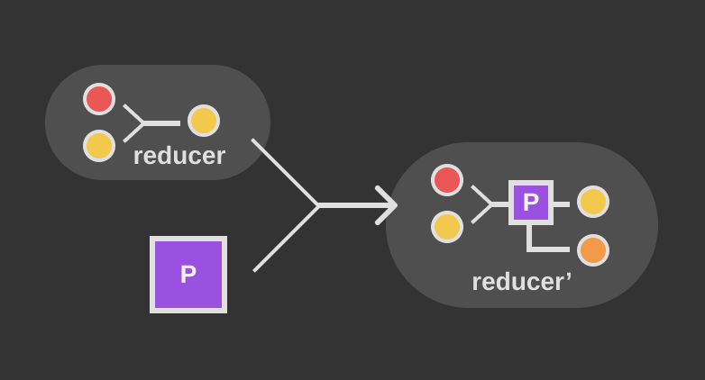

Reducers take two distinct values and combine them into a single output in some meaningful way.
Without diving too deep into the world of FP
([functional programming](https://en.wikipedia.org/wiki/Functional_programming)), suffice it to say
that it's often beneficial to write function logic in small building blocks that you can combine
together (compose) to quickly get a wide variety of pre-tested, reliable, and deterministic
functionality.

> If you're not up to speed on reducers, be sure to check out yesterday's [post](/articles/reducers)
> for a rundown.

Yesterday, we looked at `Array.prototype.reduce` as a practical example of a reducer. Remember, it
takes a reducer as a parameter to iterate over elements in an array and return a single output. Here's
an example:

```js
function joinPathComponents(...components) {
  return components.reduce((path, component) => {
    return path + '/' + component;
  }, '');
}

const path = joinPathComponents(['foo', 'bar', 'baz']);
// path === 'foo/bar/baz'
```

Here's the flow diagram for the reducer used in `joinPathComponents`:


```
 A: component (current)
 B: path (accumulator)
B': return value
```

There are two other functions on `Array.prototype` that you're likely familiar with: `.filter()` and
`.map()`. What if I told you that these are just wrappers for `.reduce()`? Actual implementation may
differ between environments, but we can get `.filter()` and `.map()` functionality just by using
`.reduce()`. Let's look at them one at a time:

## Array Filter

Filtering an array steps through each element in an array and returns a new array that contains only
the elements that pass a given test. In the programming world, **predicate** is the official term for
this sort of test. Let's write our own `.filter()` method:

```js
function filter(arr) {
  return arr.reduce((acc, current) => {
    if (current < 3) {
      acc.push(current);
    }
    return acc;
  }, []);
}

const items = [1, 2, 3, 4];
const filtered = filter(items);
// filtered === [1, 2]
```

We can do better! What's wrong with `filter` as it's written? Take a second and think about it...

Our `filter` function is
[tightly coupled](https://stackoverflow.com/questions/2832017/what-is-the-difference-between-loose-coupling-and-tight-coupling-in-the-object-o)
to its purpose. It works just fine in this _one specific context_, but what if we wanted to filter for
elements that were smaller than `10` instead of `3`? We'd have to write an entirely different
function! That's no good. Let's rewrite `filter` to accept a _predicate_:

```js
function filter(arr, predicate) {
  return arr.reduce((acc, current) => {
    if (predicate(current)) {
      acc.push(current);
    }
    return acc;
  }, []);
}

const items = [1, 2, 3, 4];
const filtered = filter(items, x => x < 3);
// filtered = [1, 2];
```

Now, if we want to test for elements smaller than `10` instead of `3`, we just switch out the
predicate!

```js
const items = [1, 2, 3, 4];
const filtered = filter(items, x => x < 10);
// filtered = [1, 2, 3, 4];
```

Let's break that down a bit. We'll rewrite our inline reducer as an independent function:

```js
function reducer(acc, current) {
  acc.push(current);
  return acc;
}

function filter(arr) {
  return arr.reduce(reducer, []);
}
```

Now how do we incorporate our predicate? Enter the **transducer**!

```js
function filterTransducer(predicate, reducer) {
  return (acc, current) => {
    if (predicate(current)) {
      return reducer(acc, current);
    }
    return acc;
  };
}

function reducer(acc, current) {
  acc.push(current);
  return acc;
}

function filter(arr, predicate) {
  return arr.reduce(filterTransducer(predicate, reducer));
}
```

Our transducer accepts a **predicate** and a **reducer** and returns a **transformed reducer**
(transducer is a portmanteau of _transformer_ and _reducer_). The transformed reducer will act like
the original reducer when the predicate returns `true`, or do nothing when the predicate returns
`false`. Here's the data flow:



## Array Map

The builtin `Array.prototype.map` takes an array and returns a new array where each element is the
result of calling a transform function on the corresponding element in the original array. It can be
built using a reducer like so:

```js
function map(arr, transform) {
  return arr.reduce((acc, current) => {
    acc.push(transform(current));
    return acc;
  }, []);
}

const input = [1, 2, 3, 4];
const doubled = map(input, x => x * 2);
// doubled === [2, 4, 6, 8]
```

What would this look like if it used a transducer?

```js
function mapTransducer(transform, reducer) {
  return (acc, current) => {
    return reducer(acc, transform(current));
  };
}

function reducer(acc, current) {
  acc.push(current);
  return acc;
}

function map(arr, transform) {
  return arr.reduce(mapTransducer(transform, reducer));
}
```

What if we only want to apply the transform function on even numbers? We could do something like:

```js
function doubleEvens(arr) {
  return arr.reduce((acc, current) => {
    if (current % 2 === 0) {
      acc.push(current * 2);
    } else {
      acc.push(current);
    }
    return acc;
  }, []);
}

const input = [1, 2, 3, 4];
const evensDoubled = doubleEvens(input);
// evensDoubled === [1, 4, 3, 8]
```

This isn't very reusable, though (it's tightly coupled). Let's refactor it to accept a `transform` and
a `predicate` so we can customize it however we want:

```js
function filterMap(arr, transform, predicate) {
  return arr.reduce((acc, current) => {
    if (predicate(current)) {
      acc.push(transform(current));
    } else {
      acc.push(current);
    }
    return acc;
  }, []);
}

const input = [1, 2, 3, 4];
const evensDoubled = filterMap(
  input,
  x => x * 2,
  x => x % 2 === 0,
);
// evensDoubled === [1, 4, 3, 8]
```

Now if we want to add `3` to the odd numbers, we just swap out our `transform` and `predicate`:

```js
const input = [1, 2, 3, 4];
const add3ToOdds = filterMap(
  input,
  x => x + 3,
  x => x % 2 === 1,
);
// add3ToOdds = [4, 2, 6, 4];
```

We can refactor _this_ using a transducer:

```js
function filterMapTransducer(transform, predicate, reducer) {
  return (acc, current) => {
    if (predicate(current)) {
      return reducer(acc, transform(current));
    }
    return reducer(acc, current);
  };
}

function reducer(acc, current) {
  acc.push(current);
  return acc;
}

function filterMap(arr, transform, predicate) {
  return arr.reduce(filterMapTransducer(transform, predicate, reducer));
}
```

Transducers take many different forms - our `filterMapTransducer` takes a `transform` function along
with a `predicate` to conditionally apply the transform.

## Putting It All Together

In the simple contexts we've looked at above, it seems unlikely that a transducer is justified - they
do add a bit of complexity. If you're new to JS, you've probably only worked in OO (object-oriented)
contexts and haven't messed around much with FP. If that is the case, I would encourage that you take
the time to dig in when you get a long weekend - Eric Elliot has a
[great series](https://medium.com/javascript-scene/composing-software-an-introduction-27b72500d6ea)
on Medium that's the perfect place to get started.

To make our `filter()`, `map()`, and `filterMap()` functions a bit more useful, let's quickly look at
a FP refactor:

```js
const filterFP = predicate => arr =>
  arr.reduce(filterTransducer(predicate, reducer));

const mapFP = transform => arr => arr.reduce(mapTransducer(transform, reducer));

const filterMapFP = transform => predicate => arr =>
  arr.reduce(filterMapTransducer(transform, predicate, reducer));

const getOdds = filterFP(x => x % 2 === 1);
getOdds([1, 2, 3]); // [1, 3]

const double = mapFP(x => x * 2);
double([1, 2, 3]); // [2, 4, 6]

const square = mapFP(x => x * x);
square([1, 2, 3]); // [1, 4, 9]

const squareEvens = filterMapFP(
  x => x * x,
  x => x % 2 === 0,
);
squareEvens([1, 2, 3]); // [1, 4, 3]
```

Hopefully that gives you an idea of how useful transducers can be. See you again tomorrow!
