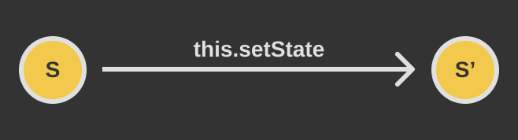
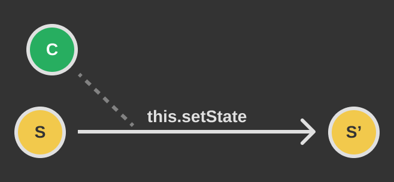

Alright, if you've been following along so far, hopefully you have a good grasp on reducers.
Say it with me:

> Reducers take two inputs and return a single output

We've looked at reducers [in exclusion](/articles/reducers), as well as how they can be transformed
using [transducers](/articles/transducers). Today, we're going to look at a slightly different type
of reducer - **ninja reducers**! Yes, I did just make that term up on the spot, but I think you get
the implication - these reducers are hiding in plain sight. They may not look like a reducer at first
glance, but they are, I promise.

First, a brief refresher. When I say reducer, you should picture something like this:


An initial data source `B` is combined with some sort of modifier `A` and the result is a transformed
into a new data source `B'` (pronounced _B prime_). In practice, this flow takes many different names
and roles, but you should always be able to outline it in this **Y-shaped, 2 becomes 1** pattern.

## React Component State

Let's take a detour into frontend land and head over to the React corner. In case you're unfamiliar,
React is (in their [own words](https://reactjs.org/)) "[a] JavaScript library for building user
interfaces". It's beyond the scope of this article to go in-depth into React's state model and
component implementation, so if you've never worked with a stateful component-based UI framework like
React, take some time and head over to React's
[tutorial](https://reactjs.org/docs/getting-started.html) before reading any further.

Component classes should always extend `React.Component` and get access to `setState` as a result.
Component state lives in an immutable class instance variable named `state`. Since it's immutable,
it can only be updated using the setter method `setState`. Here's an example for some context:

```js
import React from 'react';

class MyComponent extends React.Component {
  state = {
    clicked: false,
  };

  onClick = () => {
    this.setState({ clicked: true });
  };

  render() {
    return (
      <button onClick={this.onClick}>
        {this.state.clicked ? 'clicked!' : 'click me'}
      </button>
    );
  }
}
```

Not too exciting, but it does the job well enough. Let's take a closer look at the `onClick` handler:

```js
onClick = () => {
  this.setState({ clicked: true });
};
```

## setState Accepts A Reducer

Take a close look at the argument to `this.setState`. What if I told you `setState` always used a
reducer to update `this.state`? How could that be? It's just an object, right? As it's written,
it's tough to see how an object could be a reducer, so let's take a peek under the hood and see
what's _actually_ going on when you call `this.setState` with an object parameter.

It probably looks something like this, right?

```js
// NOTE: this is not the real React source
class Component {
  state = {};

  setState = newState => {
    this.state = newState;
  };
}
```

Not quite. If we look at the [docs](https://reactjs.org/docs/react-component.html#setstate) for
`setState`, we see that it accepts _either_ an object or a function as the first parameter. If you
pass a function it should have the following shape:



Your _state updater_ function should accept a copy of the current component state and return a new
object that represents the new state after your modifications have been performed. If you just pass
an object to `setState` instead of a function, React will automagically transform it into an
updater. Let's update our psuedo-implementation:

```js
// NOTE: this is not the real React source
class Component {
  state = {};

  setState = updaterOrNewState => {
    let updater = updaterOrNewState;
    if (typeof updaterOrNewState === 'object') {
      updater = () => updaterOrNewState;
    }
    this.state = updater(this.state);
  };
}
```

This still doesn't look like a reducer though, right? It's just a straight line, a single input
(the previous state) and a single output (the updated state). Where's the **Y-shaped, 2 becomes 1**
pattern? Let's pull off this ninja reducer's mask!

## The Big Reveal



The missing piece of the puzzle here, the second input to the `setState` reducer, is the
**closure**! JS implements function closures, which means any operation has access to any and all
variables that were _in scope when it was declared_. An operation's scope includes the function that
_closes_ around it, as well as any higher level functions that close around _that_ function, all the
way up to the _global scope_. This is sometimes also referred to as a function's **context**.

So, even though `this.setState`'s updater only accepts one input _paramater_, it accepts a second
source of input in the form of the surrounding context. Sometimes we don't care about the context
and just throw it away, like:

```js
this.setState(prevState => ({
  clicked: true,
}));
```

The important takeaway is that the context is always _available_, even when we don't use it. Many
things can be part of context, from function parameters to class instance variables all the way up
to global dependencies, as shown below.

```js
import { data } from '../data';

const MINIMUM_VALUE = 0;

class MyComponent extends React.Component {
  /*...*/

  onClick = (foo, bar) => {
    this.setState(prevState => ({
      foo,
      bar,
      baz: this.props.baz,
      qox: 'qox',
      quuz: MINIMUM_VALUE,
      fizz: prevState.count + 1,
      buzz: data,
    }));
  };

  /*...*/
}
```

We can still find our **Y-shaped, 2 becomes 1** pattern, we just have to look a little closer!
Reducers are everywhere, you just have to know _how to look for them_.
