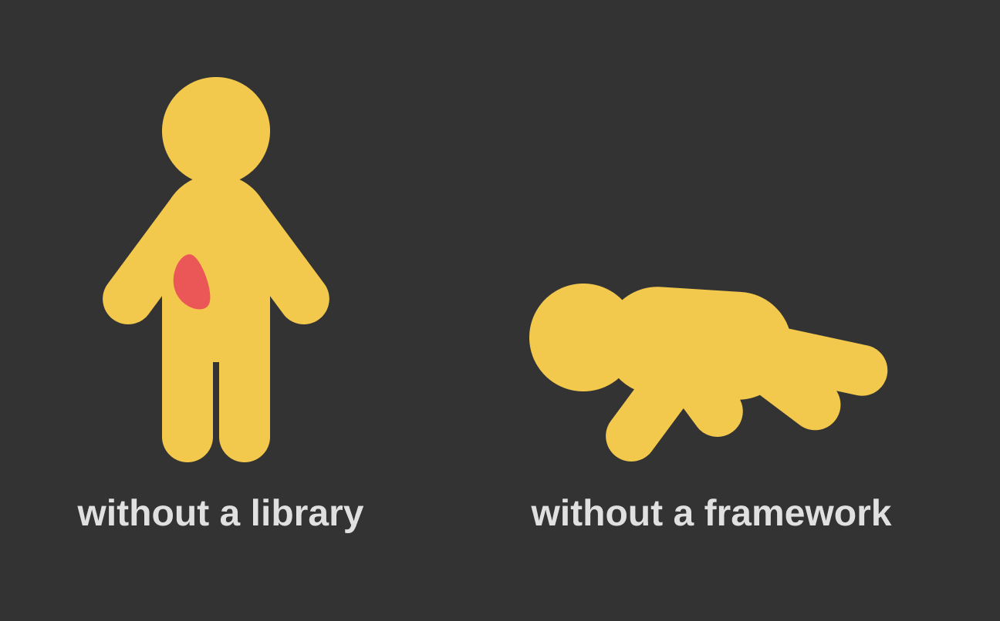

If you've been following the React scene for the last few months, you're no doubt familiar with
the (until recently) experimental [Hooks API](https://reactjs.org/docs/hooks-intro.html). A few
weeks back, I gave a [talk](https://github.com/superhawk610/why-react-hooks) that took a long look
at what hooks bring to the table. Feel free to check out the repo for yourself, there's quite a bit
there to unpack. To commemorate their official release, I want to talk briefly about the higher-level
advantages of hooks' state interaction paradigm.

If you're not feeling particularly philosophical, feel free to skip to [here](#hooks-api) to get
straight to the hooks goodness.

## Libraries & Frameworks

On a [recent episode](https://reactpodcast.simplecast.fm/31) of React Podcast with
[Ryan Florence](https://twitter.com/ryanflorence), an interesting question arose:

> What distinction is there between a **library** and a **framework**?

By their [own admission](https://reactjs.org/), React is a library. A library may be defined as a
set of additional functionality used to augment your codebase. By this definition, React is a
library - a React application sans React would no doubt lose function without including React.
What's a framework, then? A framework is by definition more integral to your codebase than a
library - take away a library and your application loses some subset of function, take away a
framework and your application ceases to function, period.



If an application is a human body, I picture every organ as a library and the skeleton as a
framework - lose a kidney and your function will be impaired, but take away your skeleton and
you really can't do much of anything.

## React As A Framework

Ryan provided a great way to distinguish a library from a framework - _you call_ a library, a
framework _calls you_. When you need to do something complicated or need to make sure something
works correctly every time, you may reach for a library and call the functions _yourself_.
When you would instead like to declaratively provide pieces of UI and have them assembled and
displayed _for you_, you will reach for a framework instead. As such, I like to think of React
as a framework.

When we think of frameworks, what sets one apart as better than the rest? What do we look for
when choosing a framework? Performance, ease of use, accessibility, learning curve - there
are many considerations when deciding which framework to use. As a developer working within
that framework, what makes you enjoy one over another?

In my opinion, the best frameworks are those that allow you to forget they're there at all.
At the end of the day, a framework's job is to allow the developer to iterate quickly and ship
performant code without having to pause at every step along the way to consider things like
performance optimization or complex implementation strategies.

## Thinking Like A Component

A shortcoming of many frameworks is that they _feel like frameworks_. When you design a React
component, you have to think about the component lifecycle and describe it's function in terms
of _what React is doing_, not in terms of what you actually want the component to accomplish.

If you want your component to fetch data when it mounts, you add that code to `componentDidMount()`.
If you want your component to redo some calculations when its props change, you need to add that to
`componentWillReceiveProps()` (or more recently `getDerivedStateFromProps()`). If you want to respond
to the component re-rendering, you need to implement `componentDidUpdate()`.

If you've done much work at all with React, this should all be second nature by now, but what if there
were a better way? After all, we're developers, not a framework. Why shouldn't we be able to think in
terms of how the end user will interact with a component? Mr. End User likely knows nothing about
component lifecycles or state management or when to use instance variable over state, he just wants
to get his online order submitted quickly and painlessly.

What if instead of thinking about where in the lifecycle you should do something, you could instead
simply _describe what you want to happen_ and let React take care of hooking into the correct
lifecycle methods? What if you could just say "I want this data available during render, and I need
to refresh it every 10 seconds?" Can you see where this is heading?

## Declarative vs. Imperative

All code written can be broadly grouped into two categories - **declarative** and **imperative**.
Declarative code describes _what the code should do_, while imperative code describes _how it should
go about doing it_. Declarative code is really only possible in higher-level languages, but
thankfully it's 2019 and we're web developers so we don't have to worry about that 😎. Imperative
code is best when you need the squeeze the best performance possible out of a function, and has the
upside of being a very close indication (if not an exact set of directions for) what the CPU is
doing.

Imperative code requires a good bit of overhead - we're humans, and our brains just aren't wired to
think in the same way as a processor. In the modern JS ecosystem, if you can think it, you can build
it, and odds are someone's already put in the imperative work for you. Above all else, I believe the
greatest advantage of using hooks is writing components with largely declarative code - you get to
think less like the framework and more like the end user.

## Hooks API

It seems I've gone a bit long-winded, so I'm going to postpone my original hooks write-up until
tomorrow when I can do it justice with a dedicated article. In the meantime, here's a taste
of what you can expect from hooks:

```js
import React from 'react';

import { useUserStatus } from '../hooks/useUserStatus';
import { useInput } from '../hooks/useInput';
import { useMap } from '../hooks/useMap';

function SettingsComponent({ id }) {
  const { online } = useUserStatus(id);
  const [username, onChangeUsername] = useInput('superhawk610');
  const [email, onChangeEmail] = useInput('superhawk610@gmail.com');
  const [settings, toggleSetting] = useMap({
    private: true,
    notifications: false,
  });

  return (
    <>
      <h1>{online ? 'Online' : 'Offline'}</h1>
      <form>
        <input value={username} onChange={onChangeUsername} />
        <input value={email} onChange={onChangeEmail} />
        <input type="checkbox" onChange={toggleSetting('private')} />
        <input type="checkbox" onChange={toggleSetting('notifications')} />
      </form>
    </>
  );
}
```

Hooks are awesome! Check back tomorrow for a demo - I might even explain what all that code does 😉
