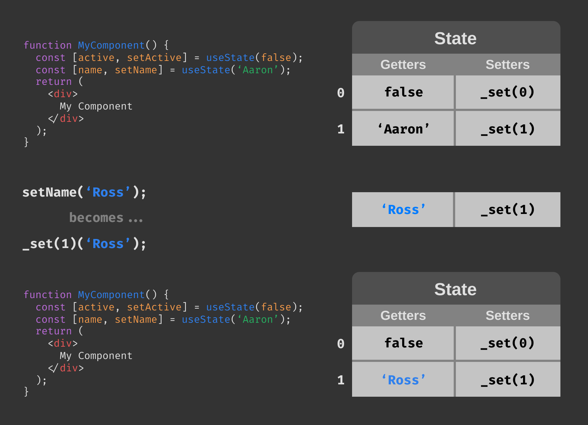

React 16.8.0 released yesterday, bringing along with it the official stable release of the
Hooks API. Yesterday, we [talked](/articles/react-hooks) about the high-level offerings that
this API brings to the table, and today we'll look at how to implement this API in your next
application (or even toss it into a current project).

Hooks comes as a minor version release with no breaking changes - you are free to upgrade any
existing project's dependencies to 16.8.0 without having to worry about breaking existing
function.

```
npm i -S react@16.8.0 react-dom@16.8.0
```

To put it briefly, hooks brings state and lifecycle methods to function components. Previously,
if you wanted to persist changes across renders or run effects when your component passed a
lifecycle checkpoint, you were forced to use a class component that extends `React.Component`. With
hooks, you may now reach for this additional functionality from within your function body and have
it reliably persist between renders.

## Hooks API

Without further ado, let's take a look at hooks's syntax.

```js
import React, { useState } from 'react';

function MyComponent() {
  const [name, setName] = useState('Aaron');
  return <h1>{name}</h1>;
}
```

The first thing you'll notice is the hook import:

```js
import { useState } from 'react';
```

Hooks always begin with `use` and you get a handful of base hooks to work with directly from `react`.
There are a few constraints you must follow when using hooks:

1. Hooks must begin with `use`.
2. Hooks may only be called from the top level function context.
3. Hooks cannot be called conditionally (for example, inside of an `if` block or `for` loop).
4. Hooks must be called in the same order each render.

When calling `useState`, you provide an initial value and get back a copy of the state value and a
function you may use to update it. On subsequent renders, that value will hold the updated state
value.

You can imagine hooks as a way of hanging up state between renders. Below is a diagram to help you
visualize this process:



Let's walk through this:

- First render
  - `useState` is called and initializes the first element of the state array
    - the _getter_ for this element is set to the initial state value `false`
    - the _setter_ for this element is set to an updater function that updates the value stored in index 0 in the state array
  - `useState` is called again and initializes the second element of the state array
    - the _getter_ for this element is set to the initial state value `'Aaron'`
    - the _setter_ for this element is set to an updater function that updates the value stored in index 0 in the state array
- Update state via `setName`
- Second render
  - `useState` is called and sees that a state value exists in index 0, so it populates `active` and `setActive` with the existing values
  - `useState` is called again and sees that a state value exists in index 1, so it populates `name` and `setName` with the existing values. Since this state value was updated, it will now contain the updated value `Ross`.

It's important to note that this is simply a visualization (hook state is actually stored as a linked
list, see [Additional Resources](#additional-resources) below to check the source), but I believe it
makes visualizing the flow much easier.

You'll notice that `useState` is called once per state value, as opposed to what you may be accustomed
to with class component state where all state values are stored as properties on a single state
object. This is convention with hooks, but not
[strictly necessary](https://reactjs.org/docs/hooks-faq.html#should-i-use-one-or-many-state-variables).

## Lifecycle Hooks

The most common hook you'll encounter after `useState` is the lifecycle effect hooks `useEffect`.
Here's an example:

```js
import React, { useState, useEffect } from 'react';
import { ApiService } from '../services/api.service';

function MyComponent({ id }) {
  const [user, setUser] = useState(null);
  useEffect(() => {
    const subscription = ApiService.subscribe(user => setUser(user));
    return () => {
      subscription.unsubscribe();
    };
  }, [id]);
  return <h1>{user.name}</h1>;
}
```

The effect hook accepts a callback to be executed after each render. This callback may optionally
return a cleanup function to perform any necessary cleanup. This hooks also optionally accepts an
array of dependencies as a second argument. If provided, this hook will cleanup and reinitialize
any time any one of these dependencies changes (in our example above, we would want to change up
the subscription any time the component's `id` prop changes).

If you only want an effect to run once upon mount (to emulate the effect of `componentDidMount` in
class components), you just provide an empty array. You can also use this pattern to run code only on
dismount, as shown below:

```js
import React, { useEffect } from 'react';

function Mounter() {
  useEffect(() => {
    console.log('I just mounted!');
  }, []);
  return /*...*/;
}

function Unmounter() {
  useEffect(() => {
    return () => {
      console.log('I just unmounted!');
    };
  }, []);
  return /*...*/;
}
```

## Custom Hooks

Perhaps the coolest feature of hooks is the ability to create your own custom hooks. Component-based
design lets you create reusable units for each piece of UI your application will require. Custom
hooks allow you to do the same thing with function logic! Right out of the gate, this allows you to
clean up commonly used state interactions such as binding an input to a state value:

```js
import React, { useState } from 'react';

function InputComponent() {
  const [value, setValue] = useState('');

  function onChange(event) {
    setValue(event.target.value);
  }

  return <input value={value} onChange={onChange} />;
}
```

We can then extract this into a custom hook like so:

```js
import React, { useState } from 'react';

function useInput(defaultValue = '') {
  const [value, setValue] = useState(defaultValue);

  function onChange(event) {
    setValue(event.target.value);
  }

  return [value, onChange];
}

function InputComponent() {
  const [value, onChange] = useInput();
  return <input value={value} onChange={onChange} />;
}
```

To clean it up and make it more reusable, we can move `useInput` into its own file and import it when
we want to use it:

```js
// hooks/useInput.js
import { useState } from 'react';

export function useInput(defaultValue = '') {
  const [value, setValue] = useState(defaultValue);

  function onChange(event) {
    setValue(event.target.value);
  }

  return [value, onChange];
}
```

```js
// InputComponent.js
import React from 'react';
import { useInput } from '../hooks/useInput';

function InputComponent() {
  const [value, onChange] = useInput();
  return <input value={value} onChange={onChange} />;
}
```

Custom hooks enable a _fix it and forget it_ paradigm, which is great for productivity. You can return
anything you want from a custom hook, and you can even compose custom hooks out of other custom hooks!

## Additional Resources

Here are some other great resources that I think will prove useful in your journey to implementing
React hooks:

- Making Sense of React Hooks - Dan Abramov [link](https://medium.com/@dan_abramov/making-sense-of-react-hooks-fdbde8803889)
- React Today and Tomorrow - Dan Abramov & Sophie Alpert [link](https://www.youtube.com/watch?v=V-QO-KO90iQ)
- Hooks are Mixins with Ryan Florence - React Podcast [link](https://reactpodcast.simplecast.fm/31)
- React hooks: not magic, just arrays - Rudi Yardley [link](https://medium.com/@ryardley/react-hooks-not-magic-just-arrays-cd4f1857236e)
- Under the hood of React's hooks system - Eytan Manor [link](https://medium.com/the-guild/under-the-hood-of-reacts-hooks-system-eb59638c9dba)
- React Hooks collection - @nikgraf [link](https://nikgraf.github.io/react-hooks/)
- React Hooks Documentation [link](https://reactjs.org/docs/hooks-intro.html)
- React Hooks source [link](https://github.com/facebook/react/packages/react-reconciler/src/ReactFiberHooks.js)

I've compiled these and more into a [talk and demo](https://github.com/superhawk610/why-react-hooks)
on my GitHub. Feel free to check it out.
