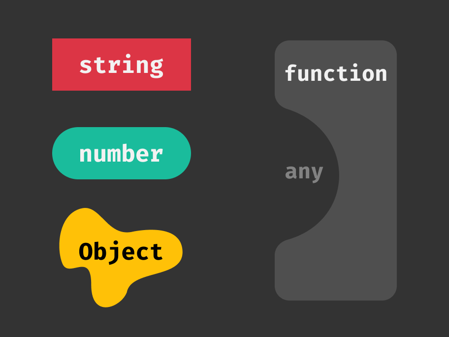
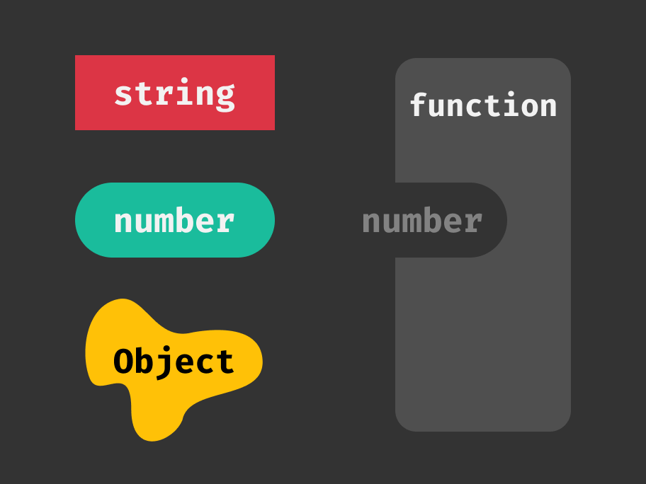
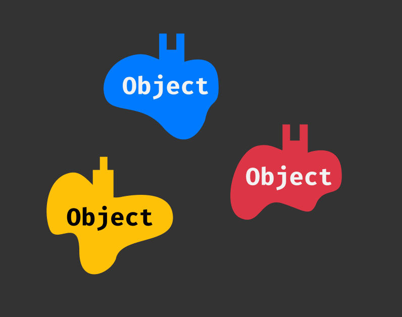
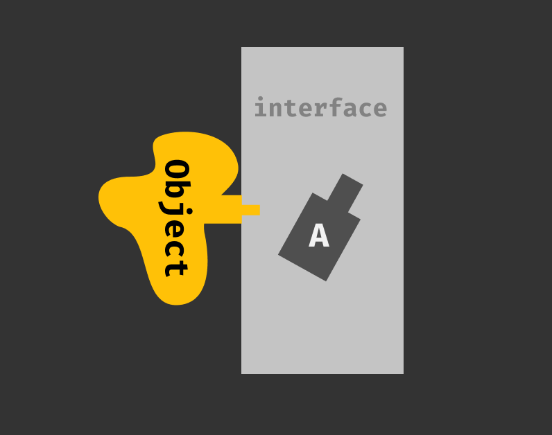
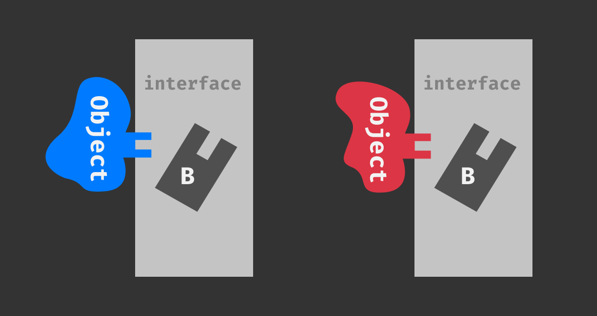

If JavaScript is your first foray into the world of programming, you may be somewhat unfamiliar with the concept of variable typing. You've
likely come across the topic in passing but haven't given it much thought. If, on the other hand, JS wasn't the first stop on your
programming journey and you came from a background in a strongly typed language like Java or C, JS likely feels like a magical playground
where anything goes and occasionally breaks for no reason (😉).

Every variable, whether declared via `var`, `let`, or `const` has a type. If you don't believe me, just pop open a console and try out the
`typeof` operator. This operator will return a string describing the type of the variable that follows:

```js
typeof 'foo' === 'string'
typeof 123 === 'number'
typeof () => {} === 'function'
typeof {} === 'object'
typeof false === 'boolean'
typeof undefined === 'undefined'
```

## Who Needs Types?

When performing mundane tasks in JS, you can often completely disregard variable types and everything will **just work&trade;**. But why?
How does this dark magic work? JavaScript performs **implicit type coercion**, which means that any time an operation requires a particular
variable type, it will just treat the variable it gets as though it were that type (though it may not be) and hope that it works.

Let's look at an example. We want to take a string and concatenate another string onto the end of it:

```js
function concat(str1, str2) {
  return str1 + str2;
}
```

This works great if we pass two strings, but what happens if we pass a number as the second argument?

```js
concat('foo', 'bar'); // foobar
concat('foo', 123); // foo123
```

It just works! The number `1` is _implicitly coerced_ to a string and then the two strings are concatenated as any two strings would be.

## When Types Attack

As with most things that "just work," there are plenty of cases where it doesn't. What happens if we pass _two numbers_ to our `concat`
function?

```js
concat(123, 456); // 579
```

Huh? It should have logged `123456`, right? The `+` operator performs different for numbers and strings: it adds numbers together and it
concatenates strings. Instead of concatenating `123` to `456`, it added them together. Here's an incredibly detailed approximation of how
JS sees variables and functions:



Variables have distinct shapes determined by their type, and functions are essentially just bottomless pits that will fit any sort of
variable, and any number of them too - even though we only handle the first 2 parameters in `concat`, we could call it with as many
parameters we like and JS would just shrug and say "OK":

```js
concat('foo', 'bar', 'baz', 'qux', 'quuz'); // foobar
```

If you're not diligent when writing and testing your code, it's easy to [footgun](https://twitter.com/suchipi/status/1093997146284556288)
yourself by not understanding the intricacies of JS's type coercion.

## Strong, Static Typing

We're professionals and we want to make sure our code runs predictably and reliably. How can we combat JS's
[weak, dynamic type system](https://en.wikipedia.org/wiki/Type_system#Static_and_dynamic_type_checking_in_practice)? Enter
[TypeScript](https://www.typescriptlang.org/)! TypeScript (**TS** for short) is a **superset** of JavaScript - it's a set of abstractions
built on top of JS, which means that anything you can do in vanilla JS will automatically work in TS, but TS adds in some extra stuff you
can't do in vanilla JS. In order to run TS, you will either need to compile it to vanilla JS via
[`tsc`](https://www.typescriptlang.org/docs/tutorial.html), transpile it with a bundler like
[Webpack](https://webpack.js.org/) / [ts-loader](https://github.com/TypeStrong/ts-loader) or [Parcel](https://parceljs.org/), or run it
directly with a tool like [ts-node](https://github.com/TypeStrong/ts-node).

For example, let's say we want to write a function that only accepts a single `number` parameter. JS functions are bottomless pits, though,
right? Not anymore! TS lets us restrict functions, both their parameter count and type(s).



Types may be written explicitly as _type annotations_, but they will also be _statically inferred_ by TypeScript. This means you often don't
have to put in any extra effort and get the advantages of TS's strong type system for free! Here's the function we have illustrated above:

```js
function acceptOneNumber(num: number) {
  // do something with `num` - it's guaranteed to be a number
}
```

What happens if we try to call a typed function with a variable of the wrong type?

```js
const str: string = 'a string';
acceptOneNumber(str); // Error: variable `str` is not compatible with type `number`
```

Cool, now we can specify what types we want our function to work with when we write it and then we don't have to worry about accidentally
using an incompatible variable type later down the road. To top that off, we can also explicitly declare what type a function will return:

```js
function returnsNothing(): void {}
function returnsANumber(): number {}
function returnsABoolean(): boolean {}
```

## Types, Types, and More Types

Switching to TypeScript may feel like a downside at first, since it's often advantageous to abuse JS's weak typing and have a function
accept multiple different variable types. No fear, TypeScript handles this. TS has a few built-in types for common use cases, and allows
you to construct your own custom types to fit your exact needs using **union types**:

```js
function acceptVoid(param: void) {}
acceptVoid(undefined); // this works
acceptVoid(null); // this works too

type NumberOrString = number | string;
function acceptNumberOrString(param: NumberOrString) {}
acceptNumberOrString(123); // this works
acceptNumberOrString('foo'); // this also works
```

If you're workshopping a block of code and aren't sure exactly what types you want to use, you can use the `any` type to disable TS's type
checking for that variable:

```js
function acceptAnything(param: any) {}
acceptAnything(123); // this works
acceptAnything('foo'); // this works too
acceptAnything(() => {}); // this also works
```

TS types work great for emulating `enum`s as well. Just create a union type by combining numbers or string literals:

```js
type Color = 'red' | 'blue' | 'green';
type Category = 0 | 1 | 2 | 3;
```

Some types (you'll often see this with arrays) will accept another type as a parameter to specify information about what the type contains:

```js
const numberArray: Array<number> = [1, 2, 3];
```

For simple type parameters for arrays, you can use the following shorthand:

```js
const numberArray: number[] = [1, 2, 3];
```

Pair all this up with a code editor with TS syntax/linting support and you'll very quickly find yourself with a new appreciation for TS.
If you're not sure where to start, check out [VS Code](https://code.visualstudio.com/) which has TS support right out of the box.

## Interfaces

Before we go, let's look at one more TS feature - `interface`s. An interface lets you describe distinct properties about an object's shape
and then accept any objects that fit that shape description. Let's look at some object shapes below:



Obviously objects don't actually have shapes like those illustrated, but that's representative of something like the following:

```js
const yellow = { oneProng: 'foo' };

const red = { twoProng: 'foo' };

const blue = { twoProng: 'bar' };
```

Each of these objects could have any number of other properties, but all we care about is whether
they have a `oneProng` or `twoProng` property. Let's say we want to write a function that only
accepts objects with a `oneProng` property. This is the perfect time to write an `interface`:

```js
interface OnePronged {
  oneProng: string;
}

interface TwoPronged {
  twoProng: string;
}

function acceptsOnePronged(obj: OnePronged) {}
```

Here's an illustration of our `OnePronged` interface:



Here's another of our `TwoPronged` interface (note that it accepts either `red` or `blue`):



Interfaces are great because they're one step removed from types. Interfaces will accept a variable explicitly declared to be of that
interface _or_ any object that has a compatible signature:

```js
function acceptsTwoPronged(obj: TwoPronged) {}

const a: TwoPronged = { twoProng: 'foo' };

acceptsTwoPronged(a); // this works via explicit declaration
acceptsTwoPronged({ twoProng: 'bar' }); // this works since it has a compatible signature
```

Interfaces may also provide an _index signature_, which is used to determine what type you will get when you access a property that isn't
explicitly described on the interface or access a property using array access syntax:

```js
interface Indexed {
  foo: string;
  bar: number;
  [key: string]: string | number;
}

const a: Indexed = {
  foo: 'foo',
  bar: 1,
  baz: 'baz',
  quz: 2,
};

typeof a.foo; // 'string', explicit declaration on interface
typeof a.bar; // 'number', explicit declaration on interface
typeof a.baz; // 'string' or 'number', index signature
typeof a.quz; // 'string' or 'number', index signature
```

## Conclusion

TypeScript brings with it a huge supporting community and years of testing and production usage to back it up. It does have a mild
learning curve, but as I mentioned earlier using an editor like VS Code will let your editor do most of the intuition for you. Many
libraries you're already using either include TS typings internally or provide them via
[DefinitelyTyped](https://github.com/DefinitelyTyped/DefinitelyTyped), a community-backed typing repository.

If you've never given it a shot or tried it in the past and didn't stick with it, give it another go. It will integrate seamlessly
into your workflow and will help you catch most errors before you ever run your code. After a few weeks of migrating existing projects
to TS, I can proudly say that having code work correctly on first run has become a very common occurence.
