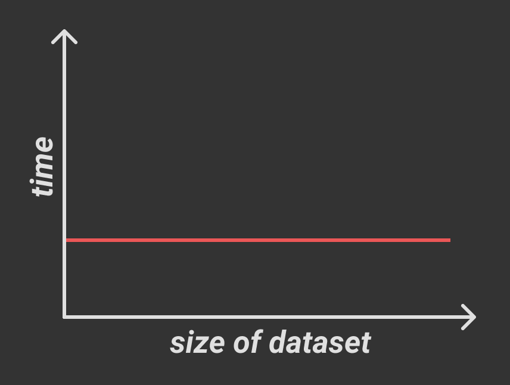
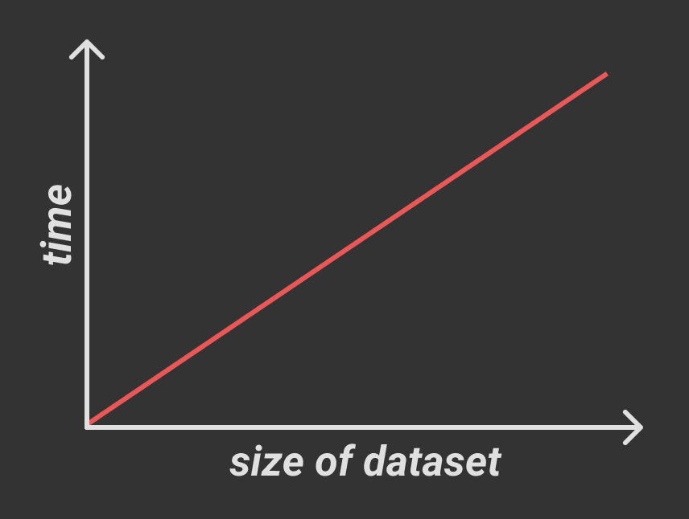
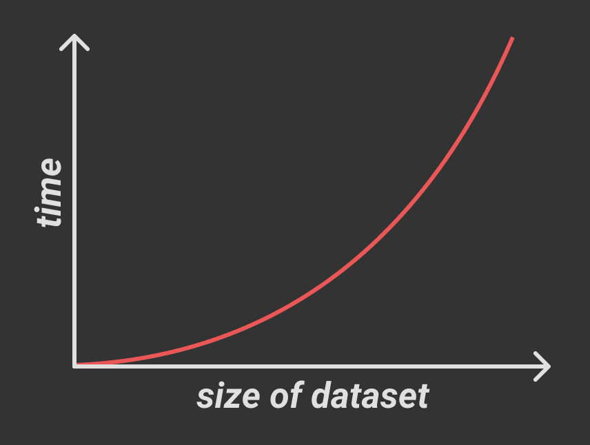
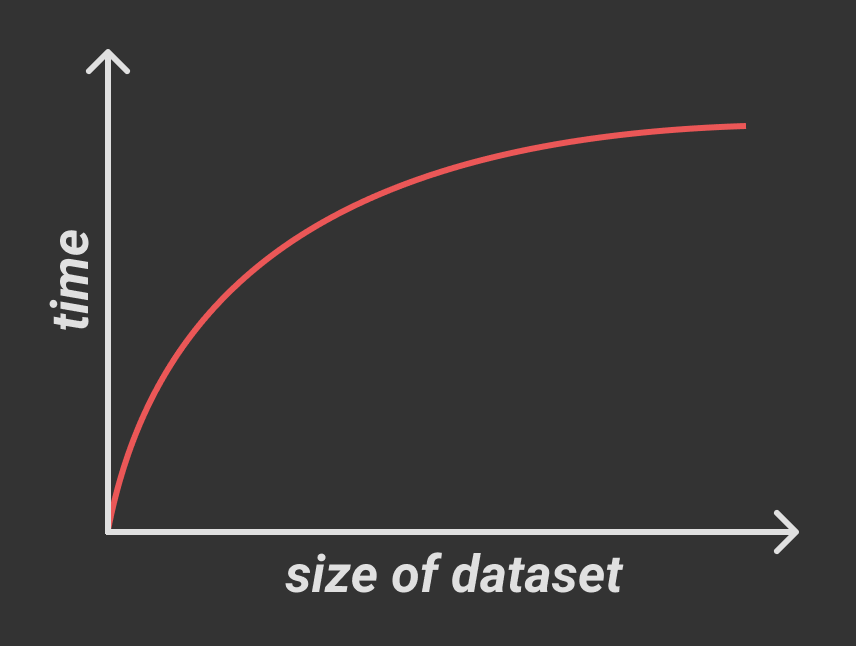
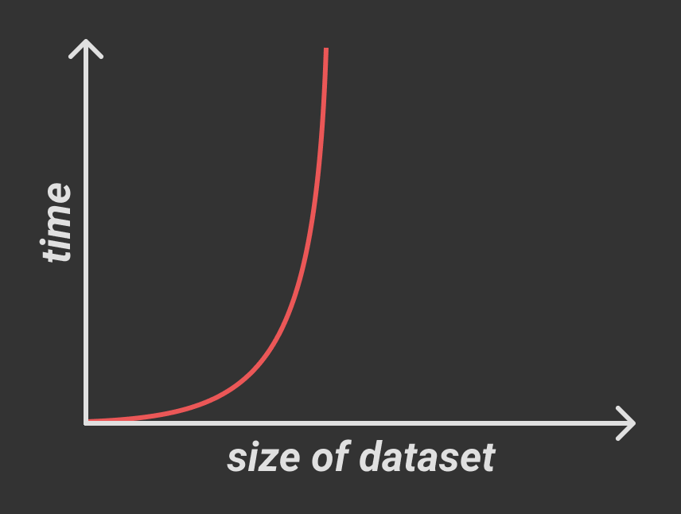

When discussing code with others, effective communication is key. It's important to be able to speak in high-level
terms without stopping to thoroughly explain each concept mentioned. To aid in this, developers make use of
language-specific [idioms](https://stackoverflow.com/questions/84102/what-is-idiomatic-code), refer to common stylistic
themes as [patterns and anti-patterns](https://stackoverflow.com/questions/980601/what-is-an-anti-pattern), and sidestep
common pitfalls by avoiding [code smells](https://en.wikipedia.org/wiki/Code_smell). Another common tool used when
discussing performance optimization is **Big O notation**, written in the format `O(n)`.

Big O notation may seem scary or unapproachable at first to many developers, largely due to its roots in mathematical
notation and lack of any real implicit meaning, but in practice it is much less difficult to use.

## Definition

Big O notation is used to describe the performance of a block of code, and more specifically how the performance will
change in proportion to the size of the input dataset. While there are many complex use cases for this notation, we'll
just go over the most common instances and give an example of what each would look like in the **Real World&trade;**.

In this notation, the value inside the `O(` and `)` describes the performance. When you see an `n`, know that it
represents the size of the incoming dataset. Big O notation describes the theoretical limits of performance, which
is generally equivalent to the **worst-case performance**. This means that the code may not _always_ perform as described
by Big O, but it will never perform any _worse_. If that doesn't make any sense, store it away and keep reading, it will
soon enough.

## Constant Time, `O(1)`

The most simple performance is **constant time**, written as `O(1)`. In constant time, performance will be the same no
matter how large the incoming dataset is. Constant time is generally desirable and scales very well.



In JavaScript, array member access takes constant time since JS arrays are stored continuously in memory. To find the
`i`th element in an array, we just take the memory address of the `0`th element and add `i` times the size of a single
element in the array. No matter how large `i` is or how large the incoming array is, we still perform this one single
calculation.

## Linear Time, `O(n)`

Another common performance is **linear time**, written as `O(n)`. In linear time, performance time increases directly
in proportion to the size of the incoming dataset.



Finding an array member matching a predicate takes linear time since we need to iterate over every item in the array.

```ts
function findIndex(arr: string[], matching: string): number {
  for (let i = 0; i < arr.length; i++) {
    if (arr[i] === matching) {
      return i;
    }
  }

  return -1;
}
```

What if the matching item is at the beginning of the array? As I said earlier, Big O notation describes **worst-case
performance**, meaning sometimes the code will run better than it describes. If the array contains `100` elements, this
function will never run more than `100` iterations, so `O(n)` means that the function will never take more than `n`
iterations to complete, where `n` is the size of the incoming dataset.

## Exponential Time, <code>O(n<sup>2</sup>)</code>

In exponential time, performance time increases directly in proportion to the square of
the size of the incoming dataset.



Exponential time is usually associated with nested iterations, with each nested iteration increasing the exponent of `n`.
For example, the following block has <code>O(n<sup>2</sup>)</code> performance:

```ts
function findNested(arr: string[][], matching: string): [number, number] {
  for (let x = 0; x < arr.length; x++) {
    for (let y = 0; y < arr[x].length; y++) {
      if (arr[x][y] === matching) {
        return [x, y];
      }
    }
  }

  return [-1, -1];
}
```

Accordingly, adding two additional levels of nesting increases this to <code>O(n<sup>4</sup>)</code> performance:

```ts
function findQuadNested(
  arr: string[][][][],
  matching: string,
): [number, number, number, number] {
  for (let w = 0; w < arr.length; w++) {
    for (let x = 0; x < arr[w].length; x++) {
      for (let y = 0; y < arr[w][x].length; y++) {
        for (let z = 0; z < arr[w][x][y].length; z++) {
          if (arr[w][x][y][z] === matching) {
            return [w, x, y, z];
          }
        }
      }
    }
  }

  return [-1, -1, -1, -1];
}
```

## Logarithmic Time, `O(log(n))`

In logarithmic time, performance time increases directly in proportion to the log of the size of the incoming dataset.



Unlike the previous performance models, logarithmic time doesn't perform particularly well on small datasets but instead
shines when dealing with large datasets. As you can see in the graph above, as the size of the dataset increases,
logarithmic time approaches **constant time** performance. This is generally found when using algorithms that recursively
halve the problem into smaller problems and solve them instead, such as binary search:

```ts
function binarySearch(
  sortedArr: number[],
  x: number,
  start = 0,
  end = sortedArr.length - 1,
) {
  // base case
  if (start > end) return false;

  // determine midpoint
  let mid = Math.floor((start + end) / 2);

  // check if midpoint contains match
  if (sortedArr[mid] === x) return true;

  if (sortedArr[mid] > x) {
    // if midpoint is greater than x, search in the left half (smaller values)
    return binarySearch(sortedArr, x, start, mid - 1);
  } else {
    // if midpoint is less than x, search in the right half (larger values)
    return binarySearch(sortedArr, x, mid + 1, end);
  }
}

binarySearch([1, 3, 5, 7, 8, 10], 5);
```

## 2<sup>n</sup> Time, <code>O(2<sup>n</sup>)</code>

This performance doesn't have any specific name, but it appears commonly enough to warrant mentioning. In this time,
performance time increases directly in proportion to `2` raised to the size of the incoming dataset. You'll recognize
this chart as the graph for `O(log(n))` rotated 90&deg;:



This performance can be observed in the following Fibonacci number generator:

```ts
function nthFibonacci(n: number): number {
  if (n <= 1) return n;
  return nthFibonacci(number - 2) + nthFibonacci(n - 1);
}
```

Performance approaches infinity (x = 0) in the same way that `O(log(n))` code approaches constant time (y = 0) as
the incoming dataset gets larger. For very small/efficient code, this is an acceptable way to express lengthy
calculations succinctly, but caution should be used since is a prime candidate for bottlenecking.

## Conclusion

Most of these examples are a bit contrived, but it's important to be able to identify the structures that cause
suboptimal performance even when they're masked by context. It's also important to know when certain problematic
performance models are acceptable, and when to prefer one model over another. In general:

- `O(n)`, <code>O(n<sup>2</sup>)</code>, and <code>O(2<sup>n</sup>)</code> are good for small datasets
- `O(log(n))` is best for large datasets
- be especially careful with exponential and <code>2<sup>n</sup></code> time since they can get out of hand fast
- you can't go wrong with linear time

Special thanks to [this article](https://rob-bell.net/2009/06/a-beginners-guide-to-big-o-notation/) by Rob Bell for
providing clear examples of the less common performance times.
